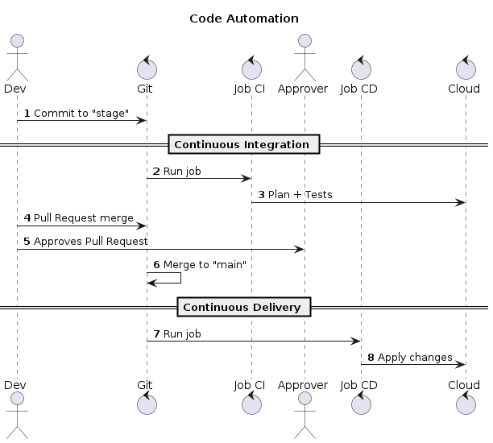

# Gitops

GitOps repo

## Concepts

### Code

- CI/CD Pipeline code
- IaC

### Git

- Versioning
- Single place automation code tracking
- Restricting users access to only git

### Tools

- GitHub Actions
- Gitlab
- ArgoCD
- Tekton
- Jenkins

## Usage

### Git Repo

#### Code

#### IaC

## References

- https://www.atlassian.com/br/git/tutorials/gitops
- https://www.alura.com.br/artigos/o-que-e-git-ops
